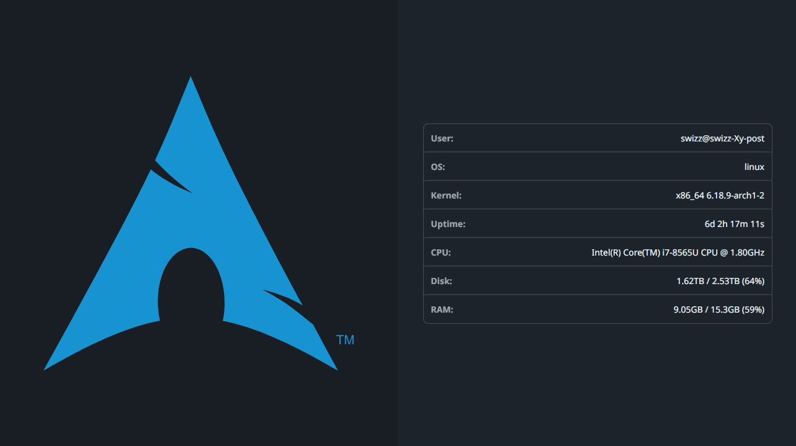

<section align="center">

# Waifetch



### Displays system informations in a GUI application,

#### similar to the popular Linux tool [`screenFetch`](https://github.com/KittyKatt/screenFetch).

</section>

## Features

- Displays system information including:
  - Username and hostname
  - Operating system details
  - Platform and kernel version
  - CPU information
  - Disk usage statistics
  - Memory usage statistics
  - Dark mode detection

## Tech Stack

- [`Go`](https://golang.org/) - The Go programming language
- [`Wails`](https://wails.io/) - Build desktop applications using Go & Web
  Technologies
- [`Sprinkle`](https://deno.land/x/sprinkle) - Full featured
  [Spræ](https://dy.github.io/sprae) engine for [Lume](https://lume.land/)
- [`Halfmoon`](https://gethalfmoon.com) - Highly customizable Bootstrap
  replacement
- [`gopsutil`](https://github.com/shirou/gopsutil) - Psutils for Golang

## Project Structure

This project is a simple demonstration with a focused aim. The main application
logic is contained in `app.go`, which collects and formats system information
for display. The `frontend/` folder contains the NueJS-based user interface.

## Prerequisites

- Go 1.19 or higher
- Bun 1.2 or higher (required for NueJS - despite its name, NueJS works only
  with Bun)
- Wails CLI (can be installed with
  `go install github.com/wailsapp/wails/v2/cmd/wails@latest`)

### Installation

1. Install backend dependencies:
   ```bash
   go mod download
   ```

2. Run the application:
   ```bash
   wails3 task dev
   ```

## Building

To build the application for your current platform:

```bash
wails build
```

For cross-platform builds, see the
[Wails documentation](https://wails.io/docs/next/reference/building).

## License

This project is licensed under the MIT License - see the
[LICENSE.md](LICENSE.md) file for details.

Inspired by [`screenFetch`](https://github.com/KittyKatt/screenFetch)
